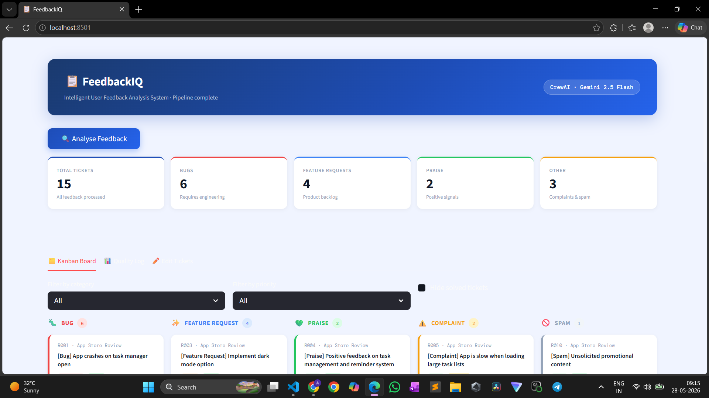
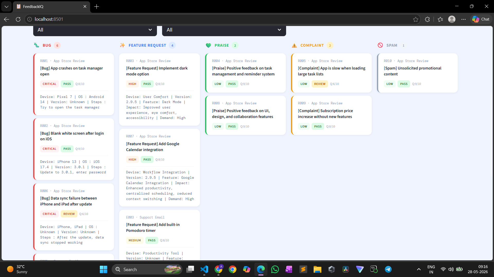

# FeedbackIQ — Intelligent User Feedback Analysis System

A multi-agent AI pipeline that automatically ingests user feedback from CSV files, classifies it, extracts technical details, and generates structured engineering tickets — with a Streamlit dashboard for monitoring and manual overrides.

---
## Dashboard




---
## What It Does

Modern app teams receive dozens of reviews and support emails daily. Manually triaging them is slow and inconsistent. FeedbackIQ automates the entire process:

1. Reads app store reviews and support emails from CSV files
2. Classifies each item — Bug, Feature Request, Praise, Complaint, or Spam
3. Extracts technical details from bug reports (device, OS, steps to reproduce)
4. Extracts feature context (impact, demand) from feature requests
5. Generates structured tickets with priority levels and saves to CSV
6. Reviews each ticket for quality and completeness
7. Displays everything on a Kanban-style dashboard

---

## Architecture

```
data/
├── app_store_reviews.csv
└── support_emails.csv
        │
        ▼
  load_feedback()        ← plain Python function, no LLM
        │
        ▼
┌─────────────────────────────────────────┐
│              CrewAI Pipeline            │
│                                         │
│  1. Feedback Classifier Agent           │
│     └─ category + confidence score      │
│                                         │
│  2. Bug Analysis Agent                  │
│     └─ device, OS, steps, priority      │
│                                         │
│  3. Feature Extractor Agent             │
│     └─ feature name, impact, demand     │
│                                         │
│  4. Ticket Creator Agent                │
│     └─ structured ticket → CSV          │
│                                         │
│  5. Quality Critic Agent                │
│     └─ quality score + notes → CSV      │
└─────────────────────────────────────────┘
        │
        ▼
output/
├── generated_tickets.csv
├── processing_log.csv
└── metrics.csv
        │
        ▼
  Streamlit Dashboard (app.py)
```

---

## Tech Stack

| Component | Technology |
|---|---|
| Agent Orchestration | CrewAI |
| LLM | Google Gemini 2.5 Flash |
| UI | Streamlit |
| Data Handling | pandas |
| Environment | python-dotenv |

---

## Project Structure

```
feedback-analysis-agent/
├──assets/
|   ├──dashboard.png
├── data/
│   ├── app_store_reviews.csv
│   ├── support_emails.csv
│   └── expected_classifications.csv
├── output/
│   ├── generated_tickets.csv
│   ├── processing_log.csv
│   └── metrics.csv
├── agents.py
├── tasks.py
├── tools.py
├── crew.py
├── csv_reader.py
├── llm.py
├── main.py
├── app.py
├── .env.example
├── requirements.txt
└── README.md
```

---

## Setup

### 1. Clone the repository

```bash
git clone https://github.com/yourusername/feedback-analysis-agent.git
cd feedback-analysis-agent
```

### 2. Create and activate a virtual environment

```bash
python -m venv venv

# Windows
venv\Scripts\activate

# macOS / Linux
source venv/bin/activate
```

### 3. Install dependencies

```bash
pip install -r requirements.txt
```

### 4. Configure environment variables

Copy `.env.example` to `.env` and add your API key:

```bash
cp .env.example .env
```

```
GEMINI_API_KEY=your_gemini_api_key_here
```

---

## Running the Project

### Option 1 — Run pipeline directly

```bash
python main.py
```

This processes all feedback, generates tickets, and saves three output CSVs to `output/`.

### Option 2 — Launch the dashboard

```bash
streamlit run app.py
```

Then open http://localhost:8501 in your browser. Click **Analyse Feedback** to run the pipeline from the UI.

---

## Output Files

| File | Description |
|---|---|
| `generated_tickets.csv` | Structured tickets with category, priority, and technical details |
| `processing_log.csv` | Quality Critic's review scores and notes for each ticket |
| `metrics.csv` | Summary stats — category breakdown, priority distribution, classification accuracy |

---

## Agents

| Agent | Responsibility |
|---|---|
| Feedback Classifier | Categorizes feedback into Bug / Feature Request / Praise / Complaint / Spam with confidence scores |
| Bug Analysis | Extracts device info, OS version, app version, steps to reproduce, and assigns severity |
| Feature Extractor | Identifies feature name, user impact, and demand level |
| Ticket Creator | Generates clean structured tickets and writes to CSV |
| Quality Critic | Reviews each ticket for completeness and assigns a quality score out of 10 |

---

## Sample Output

**generated_tickets.csv**

| source_id | category | priority | suggested_title | technical_details |
|---|---|---|---|---|
| R001 | Bug | High | [BUG] App crashes on Task Manager | Device: Pixel 7 \| OS: Android 14 \| Version: 3.0.1 \| Steps: Open app > Task Manager |
| R003 | Feature Request | Low | [FEATURE] Add dark mode support | Feature: Dark Mode \| Impact: Eye strain reduction \| Demand: High |
| E004 | Bug | Critical | [BUG] Cross-device sync causes data loss | Device: iPad Pro + iPhone 13 \| OS: iOS 17 \| Steps: Force sync > data wiped |

---

## Classification Accuracy

The system validates generated tickets against `data/expected_classifications.csv` and reports accuracy in `metrics.csv`. In testing with 15 feedback items the system achieved **~87% classification accuracy** with misclassifications occurring on ambiguous items that contain both bug symptoms and complaint language.

---
